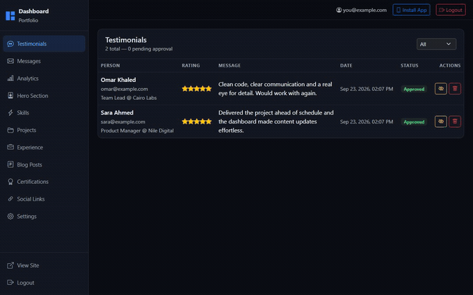
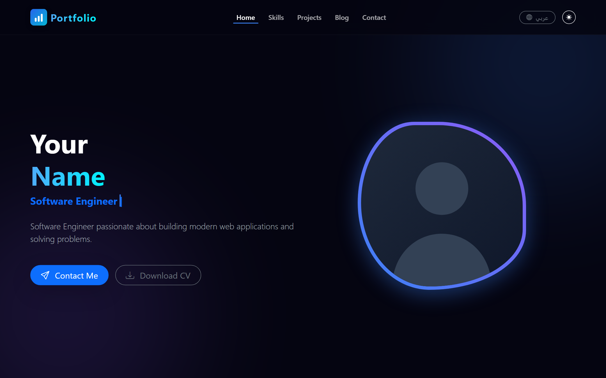
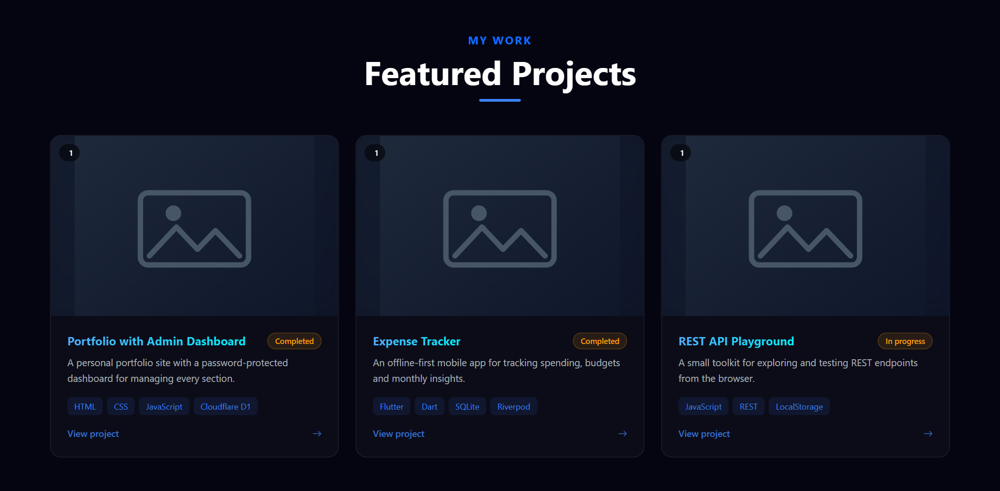
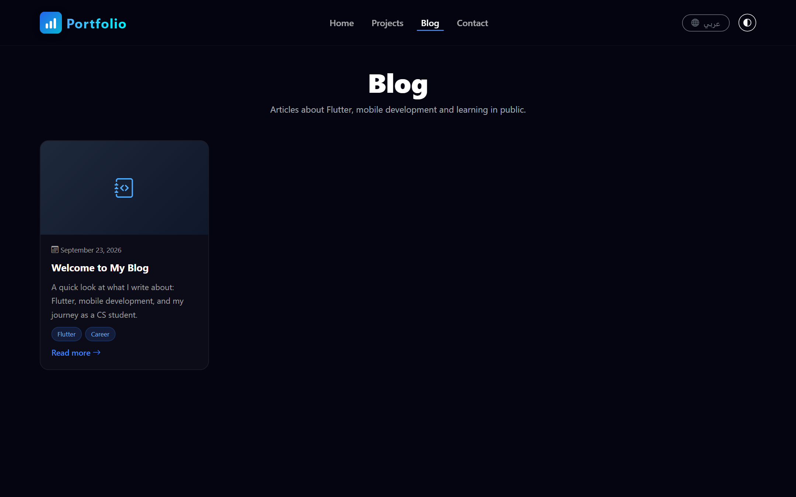
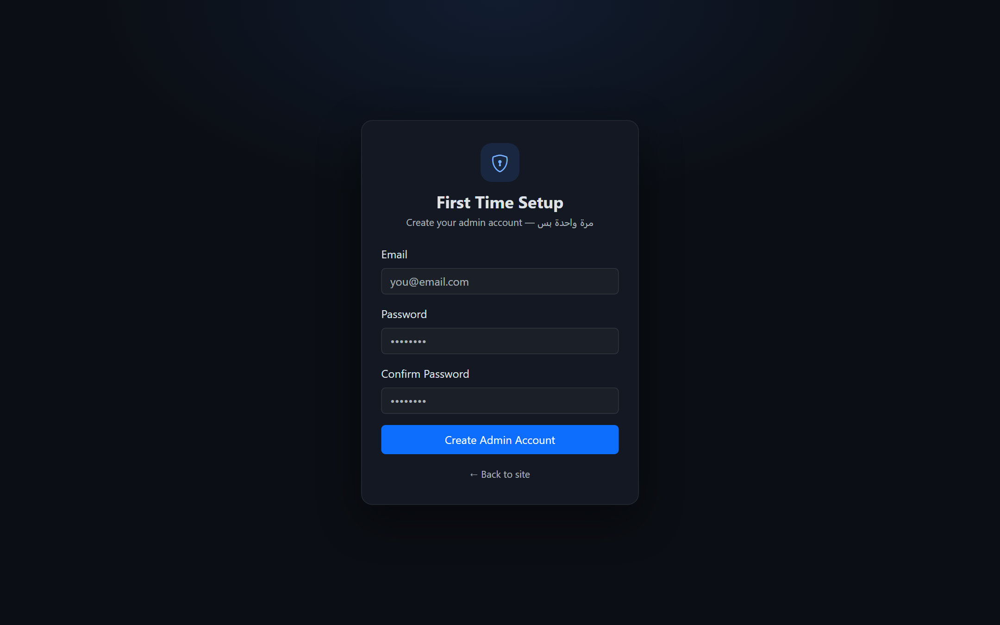
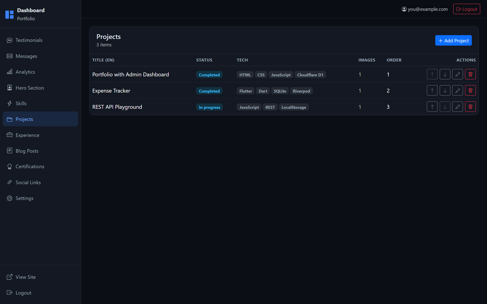
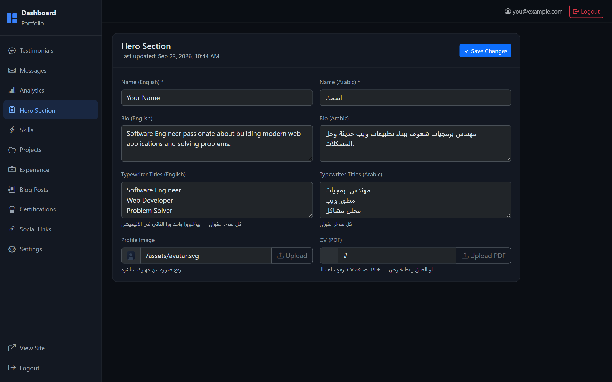

<div align="center">

# Cloudflare Portfolio

**A full-stack portfolio website with a built-in admin dashboard.**
No servers to manage, no frameworks to learn — just HTML, CSS, JavaScript and Cloudflare's free tier.

[](https://pages.cloudflare.com)
[](https://developers.cloudflare.com/d1/)
[](LICENSE)
[](CONTRIBUTING.md)
[](https://github.com/MShulkamy/cloudflare-portfolio/actions/workflows/ci.yml)

### ▶ [Try the live demo](https://cloudflare-portfolio-d49.pages.dev)



</div>

---

## What is this?

A complete personal portfolio you fully own and control:

- A **public site** with a hero, skills, projects, experience, certifications, blog and contact form.
- A **password-protected dashboard** where you edit every word — no code changes, no redeploys.
- A **REST API** built with Cloudflare Pages Functions and a **SQLite database** (Cloudflare D1).
- Optional **instant notifications** (Telegram / ntfy / email) when a visitor messages you.

Everything runs on Cloudflare's free tier. There is nothing to keep alive, so it never "sleeps" and never costs money.

---

## Screenshots

| Landing page | Projects |
|:-:|:-:|
|  |  |

| Blog | Dashboard login |
|:-:|:-:|
|  |  |

| Dashboard — projects | Dashboard — hero section |
|:-:|:-:|
|  |  |

---

## Features

### Public site
- Dark / light theme with the choice remembered per visitor
- **English + Arabic** with a full right-to-left layout
- Animated hero with a typewriter effect
- Projects with multiple images, tech tags and a full case-study view
- Experience timeline, certifications, testimonials and a blog (Markdown)
- Contact form and review form — both protected against spam
- SEO-ready: meta tags, Open Graph, Twitter cards, `sitemap.xml`, `robots.txt`

### Dashboard (`/dashboard`)
- First-run setup creates your admin account
- Full CRUD for hero, skills, projects, certifications, experience, social links and blog posts
- Moderate testimonials — nothing is published until you approve it
- Inbox for visitor messages with a direct email reply
- Anonymous visitor analytics (no cookies, no IP addresses stored)
- Drag-free ordering with up/down controls
- One-click JSON export of all your content

### Security
- Passwords hashed with **PBKDF2-SHA256** (100,000 iterations) and a per-user salt
- Sessions in **HttpOnly cookies**, 30-day expiry
- **Rate limiting** on login (10 failed attempts / 15 min / IP)
- **CSRF** protection on every mutating request
- Strict **input whitelisting** — the API can only ever touch known tables and columns
- Visitor emails are never exposed to the public site
- Security headers via `_headers` (`nosniff`, `DENY` framing, referrer policy, permissions policy)
- Dev-only paths (`/db/*`, `/scripts/*`, `/package.json`) return `410 Gone` in production

---

## Tech stack

| Layer | Technology |
|---|---|
| Frontend | HTML5, CSS3, vanilla JavaScript, Bootstrap 5, jQuery |
| Backend | Cloudflare Pages Functions (ES modules) |
| Database | Cloudflare D1 (SQLite) |
| File storage | Cloudflare R2 (optional, for dashboard image uploads) |
| Icons | Bootstrap Icons + Devicon (self-hosted) |
| Hosting | Cloudflare Pages (free tier) |

No build step is required to run the site. `scripts/` contains optional tooling for regenerating brand assets and subsetting icon fonts.

---

## Project structure

```
.
├── index.html                  # Public landing page
├── post.html                   # Blog post template
├── 404.html
├── sections/                   # Page sections (loaded at runtime)
├── js/                         # Site JavaScript (one file per section)
├── css/                        # Site styles
├── blog/                       # Blog index
├── assets/                     # Logo, icons, OG cover, placeholders
├── vendor/                     # Self-hosted icon fonts
├── dashboard/
│   ├── index.html              # Redirects to login or the dashboard
│   ├── core/                   # api, ui, layout, auth guard, CRUD helpers
│   ├── auth/                   # Login + first-time setup
│   ├── hero/ skills/ projects/ certifications/
│   ├── experience/ blog/ messages/ testimonials/
│   └── analytics/ settings/ social-links/
├── functions/
│   ├── api/[[route]].js        # The entire REST API
│   ├── blog/[slug].js          # Pretty URLs for posts
│   └── db/[[path]].js          # Guard: dev files return 410
├── db/schema.sql               # Tables, indexes and sample content
├── scripts/                    # Optional build helpers + deploy script
├── wrangler.toml               # Cloudflare configuration
└── _headers                    # Security headers
```

---

## Quick start (local)

**Requirements:** Node.js 18+ and a free Cloudflare account (only needed to deploy).

```bash
npm install        # once
npm run db:local   # create the local database + sample content
npm run dev        # start the dev server
```

Then open:

- Site → http://127.0.0.1:8788
- Dashboard → http://127.0.0.1:8788/dashboard

The first time you open the dashboard it asks you to create an admin account.

> The site must be served through `npm run dev`. Opening `index.html` directly will not work because the page talks to the API.

---

## Deploying to Cloudflare

### 1. Log in
```bash
npx wrangler login
```

### 2. Create the database
```bash
npx wrangler d1 create portfolio-db
```
Copy the `database_id` it prints into `wrangler.toml`.

### 3. (Optional) Create an R2 bucket for image uploads
```bash
npx wrangler r2 bucket create portfolio-images
```
Skip this if you would rather paste image URLs instead of uploading files.

### 4. Push the schema to production
```bash
npm run db:remote
```

### 5. Deploy
```bash
npm run deploy
```
The script stages only public files into `dist/`, runs a security check to make sure nothing sensitive leaked, then deploys with Wrangler.

### 6. Finish setup
Open `https://<your-project>.pages.dev/dashboard` and create your admin account.

### 7. Custom domain (optional)
Cloudflare Pages → your project → **Custom domains** → **Set up a domain**.

### Continuous deployment (optional)
Push the repository to GitHub, then in Cloudflare: **Workers & Pages → Create → Pages → Connect to Git**. Every push to `main` redeploys automatically.

---

## Configuration

Non-secret values live in `wrangler.toml` under `[vars]`:

```toml
[vars]
SITE_NAME = "Your Name"
SITE_URL  = "https://your-project.pages.dev"
```

Secrets are set with Wrangler (never commit them):

```bash
npx wrangler pages secret put TELEGRAM_BOT_TOKEN
```

See [`.env.example`](.env.example) for the full list. Every integration is optional:

| Variable | What it enables |
|---|---|
| `TELEGRAM_BOT_TOKEN`, `TELEGRAM_CHAT_ID` | Instant Telegram alerts, and replying to visitors straight from the chat |
| `TELEGRAM_WEBHOOK_SECRET` | Verifies webhook calls really come from Telegram |
| `NTFY_TOPIC` | Push notifications through [ntfy.sh](https://ntfy.sh) |
| `RESEND_API_KEY`, `RESEND_FROM` | Email replies from your own domain |
| `GMAIL_WEBHOOK_URL`, `GMAIL_WEBHOOK_SECRET` | Email replies without owning a domain |

---

## Making it yours

See **[CUSTOMIZE.md](CUSTOMIZE.md)** for a step-by-step checklist: name, colors, logo, social links, CV and content.

In short:

1. Edit `[vars]` in `wrangler.toml` (`SITE_NAME`, `SITE_URL`).
2. Replace the placeholders in `assets/` (logo, icons, `og-cover.jpg`).
3. Tune the accent colors in `css/style.css` (`--primary-color`, `--gradient-text`).
4. Change your name, bio and links from the dashboard — no code edits needed.

---

## Notes on security

- The `dist/` staging step refuses to deploy if it finds `wrangler.toml`, `db/`, `scripts/`, `.env` or other development files.
- The API never builds SQL from user input: table and column names come from a fixed whitelist, and all values are bound parameters.
- The visitor tracking endpoint stores a random per-browser id — never an IP address — and the dashboard only shows aggregates.

---

## Contributing

Contributions are welcome. Please read [CONTRIBUTING.md](CONTRIBUTING.md) first.

## Related projects

- **[Mizan](https://github.com/MShulkamy/mizan)** — an offline-first personal finance tracker built with Flutter, Riverpod and sqflite.

## License

[MIT](LICENSE) — use it, change it, ship it.
